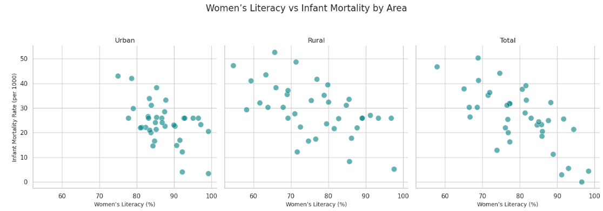
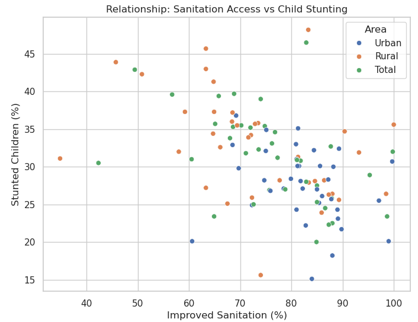
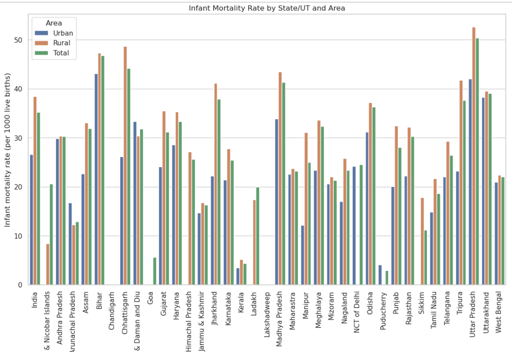
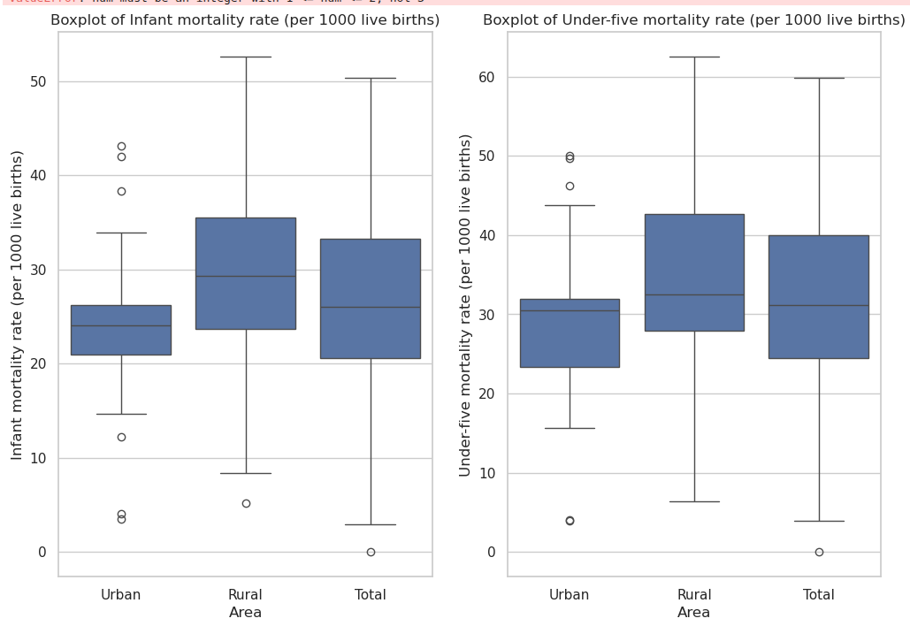

# Analysis of India's National Family Health Survey (NFHS) Data

**A deep-dive Exploratory Data Analysis (EDA) into the public health and socio-economic landscape of India, submitted for an EDA contest.**

This project performs a comprehensive analysis of the National Family Health Survey (NFHS) dataset to uncover critical insights into the state of public health across India. The analysis focuses on telling a compelling, data-driven story through a series of carefully selected and interpreted visualizations.

---

## 🎯 Key Questions Explored

This analysis seeks to answer several fundamental questions about development in India:
1.  What is the overall distribution of key health indicators like Infant Mortality, Child Malnutrition, and Fertility Rates?
2.  How significant is the **urban-rural divide**, and across which indicators is it most pronounced?
3.  Which states are leading in public health outcomes, and which are facing the greatest challenges?
4.  What is the statistical relationship between **socio-economic factors** (like female literacy, sanitation, and healthcare access) and critical **health outcomes**?
5.  Can we visually confirm the interconnectedness of various development metrics to argue for holistic policy-making?

---

## 📊 Dataset

The analysis is based on the **National Family Health Survey (NFHS)** data for India. The NFHS is a large-scale, multi-round survey conducted in a representative sample of households throughout the country. It provides a wealth of information on:
-   Population and Demographics
-   Health and Nutrition (Infant & Child Mortality, Malnutrition, etc.)
-   Access to Amenities (Clean Water, Sanitation, Electricity)
-   Education and Literacy
-   Family Planning and Healthcare Access

The dataset used in this project is `nfhs_data.csv`.

---

## 🛠️ Methodology

The project follows a structured EDA workflow:
1.  **Data Cleaning & Preprocessing:** Handled missing values by focusing on a core set of indicators and renamed columns for clarity and consistency.
2.  **Univariate Analysis:** Examined the distribution of individual variables using Kernel Density Estimates (KDEs) and Box Plots to understand their spread and identify outliers.
3.  **Bivariate & Multivariate Analysis:** Used a combination of scatter plots, regression plots, and faceted grids to explore the relationships between pairs and groups of variables.
4.  **Disparity Analysis:** Leveraged bar plots and grouped visualizations to dissect and quantify the urban-rural gap and compare performance at the state level.
5.  **Insight Synthesis:** Interpreted each visualization to build a cohesive narrative, culminating in a summary of key, actionable insights.

---

## ✨ Key Insights

The analysis uncovered several profound and interconnected insights:
-   **The Urban-Rural Divide is Systemic:** Rural areas consistently lag behind urban centers across nearly all health and development indicators.
-   **Socio-Economic Factors are Powerful Health Determinants:** There is strong statistical evidence that female literacy, access to sanitation, and availability of healthcare are powerful predictors of better health outcomes.
-   **State-Level Heterogeneity Requires Granular Policy:** National averages mask significant variations between states, highlighting the need for targeted, regional-specific interventions.
-   **Development is Interconnected:** Progress is holistic. Investing in education, for example, has a measurable positive impact on family size and child health, arguing for integrated development strategies.

---

## 💻 Technologies Used

-   **Language:** Python
-   **Libraries:**
    -   `pandas` for data manipulation and cleaning.
    -   `numpy` for numerical operations.
    -   `matplotlib` and `seaborn` for data visualization.
    -   `Jupyter Notebook` for the interactive analysis environment.

---

## 🚀 How to Run

To reproduce this analysis, follow these steps:
1.  Clone the repository:
    ```bash
    git clone https://github.com/PratikDhage/EDA-Contest-IIITDM.git
    ```
2.  Navigate to the project directory:
    ```bash
    cd EDA-Contest-IIITDM
    ```
3.  Install the required libraries:
    ```bash
    pip install pandas numpy matplotlib seaborn jupyter
    ```
4.  Launch Jupyter Notebook:
    ```bash
    jupyter notebook
    ```
5.  Open the `EDA.ipynb` file and run the cells.

---

## 📈 Key Visualizations

Below are some of the key visualizations that drive the narrative of this analysis.

| Female Literacy vs. Infant Mortality                               | Sanitation vs. Child Stunting                                |
| ------------------------------------------------------------------ | ------------------------------------------------------------ |
|  |  |

| Infant Mortality by State                                          | Key Indicators by Area (Box Plots)                           |
| ------------------------------------------------------------------ | ------------------------------------------------------------ |
|                |  |

---

## 📄 Report

For a detailed walkthrough of the analysis, interpretations, and a full synthesis of the findings, please see the final report: **[Report.pdf](Report.pdf)**.
